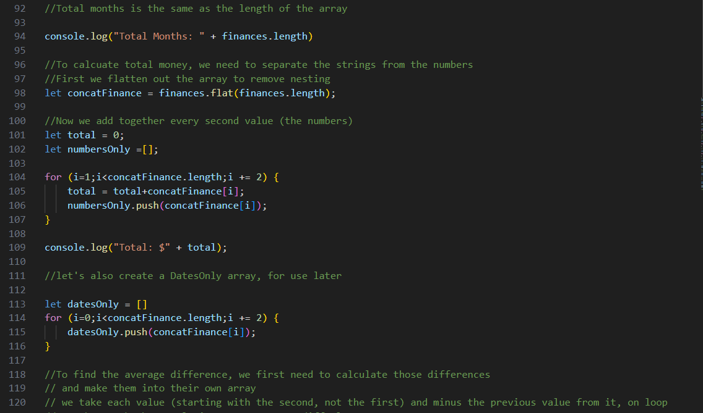
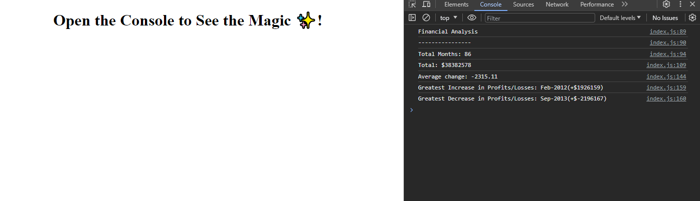

# Console-Finances

## Description

This is a series of javacript loops/calculations in order to provide the following data from an array of cashflow

- Number of months recorded
- Total income
- avg difference month-to-month
- the month with the greatest profit
- the month with the greatest loss

## Link To Application

https://ablam87.github.io/Console-Finances/

## Installation

N/A

## Usage

Provided - photo of javascript code, with detailed notes outlining my process:

Photo of finished data being printed to console:

## Credit 

Thanks to the good people at the Bootcamp for knocking up the swell starter files x

## License

MIT
